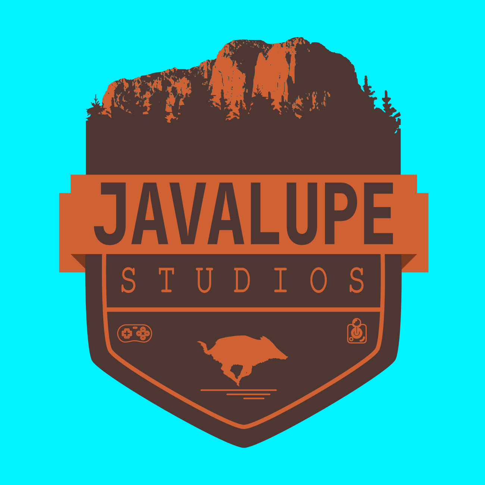

# Javalupe Studios Logo

This repo contains the logo of Javalupe Studios.

## Explanation

Our name is a mishmash of "Java" (the programming language that was used in our first game), "Luiza" and "Pedro" (the team that worked on our first game). Since it sounds a lot like "Guadalupe", our logo was made to look like a typical park logo and features *El Capitan*, the most famous landmark of the Guadalupe Mountains National Park. The boar (*javali*, in Portuguese) at the bottom is, again, a nod to the Java programming language.

## Attribution

This logo made use of the following assets:

- [Joystick](https://www.svgrepo.com/svg/149679/joystick), by SVG Repo
- [Gamepad](https://www.svgrepo.com/svg/19042/game-controller), by SVG Repo
- [El Captain at sunset with sky and clouds](https://www.goodfreephotos.com/united-states/texas/guadalupe-mountains-national-park/el-captain-at+sunset-with-sky-and-clouds.jpg.php), by Guadalupe Mountains NP

It was also inspired by the following works:

- [National Park logo design](https://www.behance.net/gallery/87434841/National-Park-Logo-Design), by Tutul Hossain
- [National Park vintage badge](https://www.vecteezy.com/vector-art/223967-national-park-vintage-badge-mountain-explorer-label-outdoor-adventure-logo-design-with-bear-travel-and-hipster-insignia-wilderness-forest-camping-emblem-hiking-backpack-vector-design-typography), by JeksonGraphics
- [Camping Logotype](https://www.canstockphoto.com.br/logotypes-logotipos-acampamento-55070898.html), by JeksonJS
- [Glacier National Park patch](https://www.dreamstime.com/vector-glacier-national-park-patch-logo-design-image252619622), by Lawoel
- [Badlands Park emblem](https://www.freepik.com/premium-vector/badlands-park-emblem-patch-logo-illustration_25034751.htm#query=yellowstone%20logo&position=36&from_view=keyword&track=ais), by swarn'o

## Gratitude

Thanks to the [Inkscape](https://inkscape.org/) contributors for openly developing and freely distribuing such an amazing tool.

## License

This work is licensed under the [CC-BY-SA 4.0](https://creativecommons.org/licenses/by-sa/4.0/)
